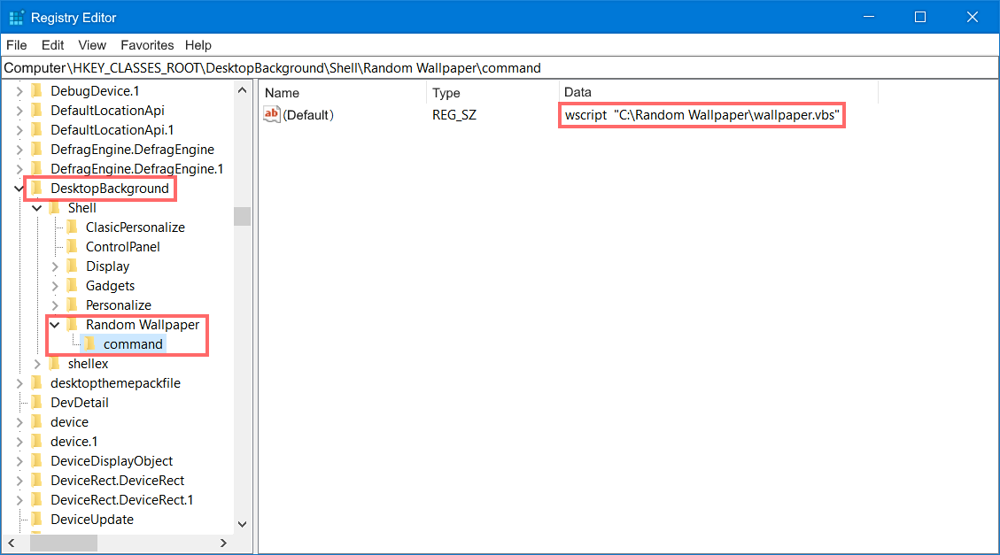
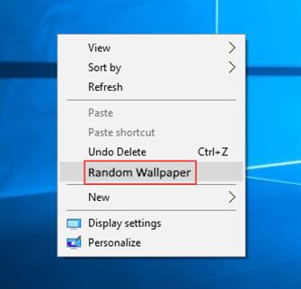

<h1 align="center">Wallpaper Randomizer</h1>

This PowerShell script is designed to change the Windows desktop wallpaper automatically to a random image from a specified folder. It retrieves all images from the chosen folder and then selects one randomly to set as the new wallpaper. A new image is chosen each time the script is executed. The script is coded for seamless operation, conveniently making your desktop appearance fresh and dynamic without any manual intervention. The versatility of the script allows for customization according to user preference.

<h2 align="center">Creating Windows context menu to run the script</h2>

Running PowerShell scripts can be challenging without any popups. Even the `-WindowStyle Hidden` switch doesn't help entirely, it merely makes the PowerShell window flash quickly on the screen before it disappears.

However, there is a way around this problem. You can initiate the PowerShell script from a compact VBScript as shown below:

```vbscript
Set objShell = CreateObject("Wscript.Shell")
strScriptPath = "C:\Random Wallpaper\script.ps1"
objShell.Run "powershell -File " & Chr(34) & strScriptPath & Chr(34), 0, False
```

Here, assign to `strScriptPath` your path to PowerShell script. Save the script as .vbs file. This VBS script will cause the PowerShell script to work silently, it will no longer display any cmd window.

Executing a .VBS script via a context menu in Windows will require a bit of registry editing:

1. Press Win + R, type `regedit` and hit Enter to open the   Registry Editor
2. Go to *HKEY_CLASSES_ROOT\DesktopBackground\Shell*
3. Here, right-click on shell directory and select *New* -> *Key*
4. Name this key with what you want your context item to be named. For example, *Random Wallpaper*
5. Right-click on *Random Wallpaper* and create a new key under it. Name it *command*
6. Select *command*, and in the right pane, double-click on *Default*
7. In the *Value data* box, key in the location of your .VBS script preceded by wscript.exe. The full input should look like this: `wscript "C:\Random Wallpaper\wallpaper.vbs"`

The Registry Editor should look like this:

<p align="center">
    
</p>
 
Once this is done, you should see *Random Wallpaper* in your context menu when you right-click on the desktop:

<p align="center">
    
</p>

Clicking on it will execute your VBS script and thus apply a random wallpaper.
